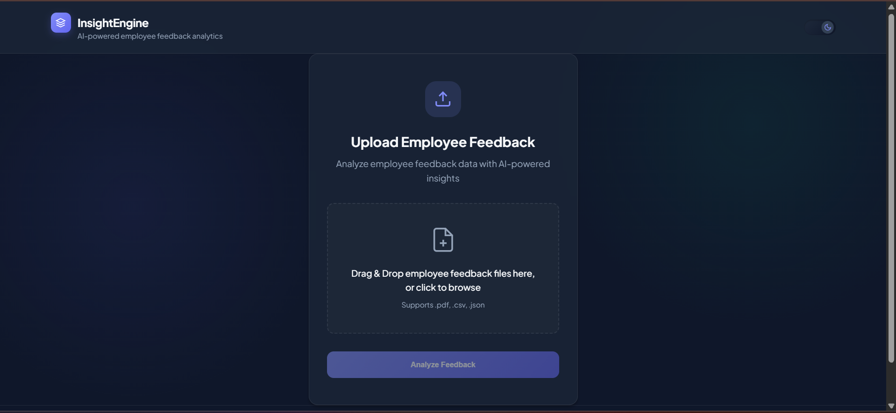
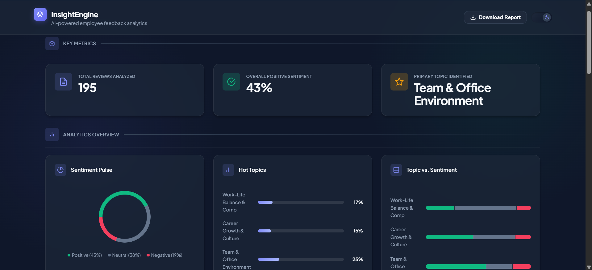
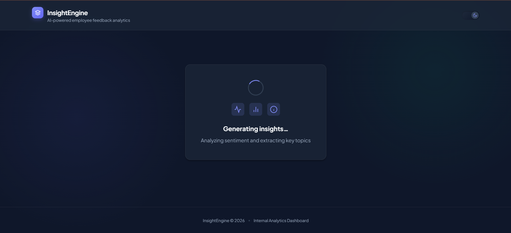
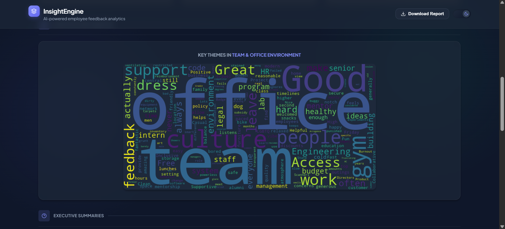
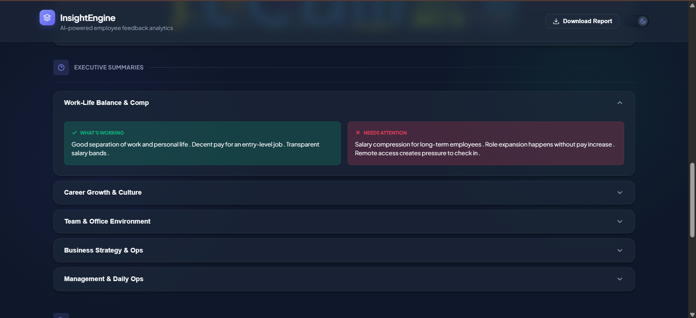
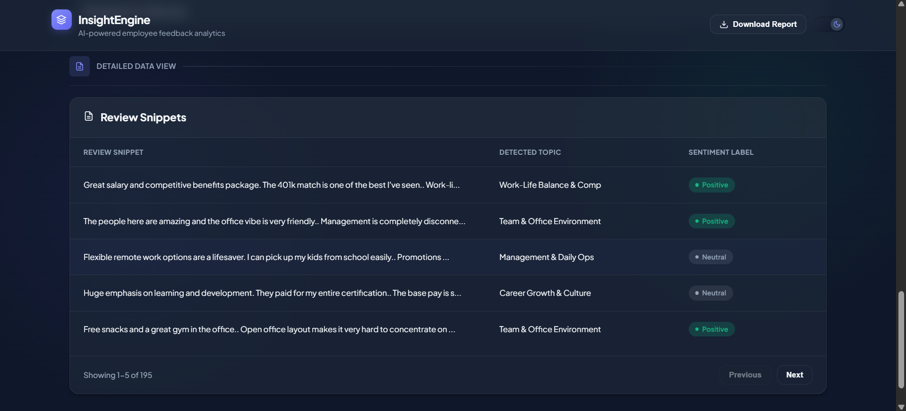
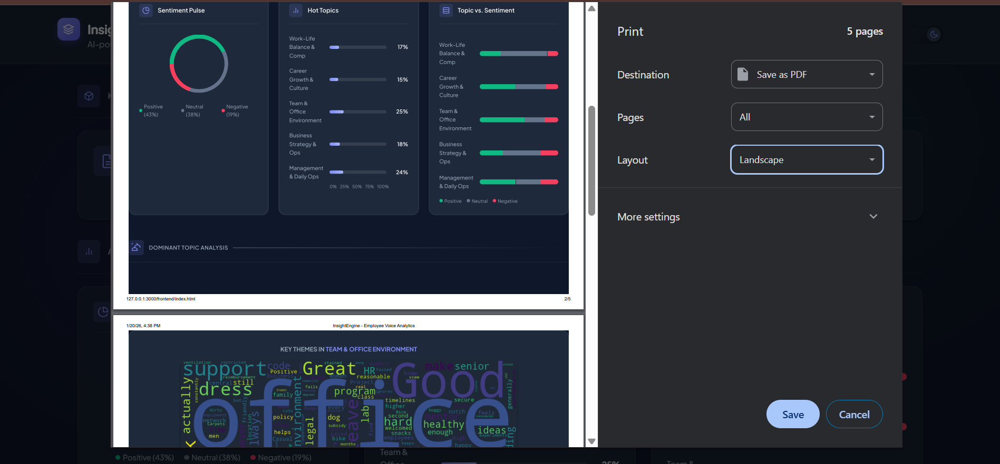
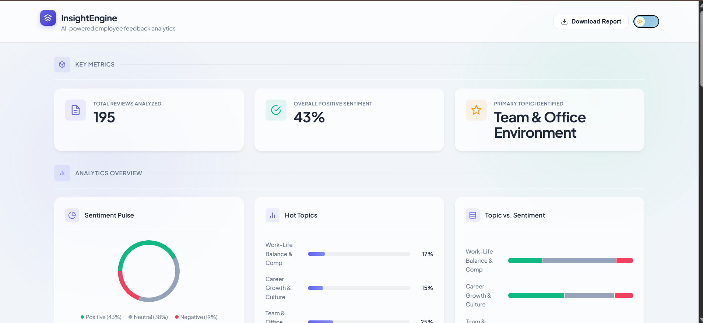

# 🔍 InsightEngine  
### Dynamic Text Analysis Platform for Job Reviews

InsightEngine is an end-to-end **NLP-powered text analysis platform** that transforms unstructured job review data into meaningful insights.  
The system allows users to upload datasets and explore **sentiment trends, key topics, word clouds, and abstractive summaries** through an interactive dashboard.

---
## 📸 Application Screenshots

### 🔹 Core User Flow

<table>
  <tr>
    <td align="center">
      
      <br />
      <b>Upload Page</b>
    </td>
    <td align="center">
      
      <br />
      <b>Insights Dashboard</b>
    </td>
    <td align="center">
      
      <br />
      <b>Insight Generation</b>
    </td>
  </tr>
</table>

---

### 🔹 NLP Analysis Outputs

<table>
  <tr>
    <td align="center">
      
      <br />
      <b>Word Cloud</b>
    </td>
    <td align="center">
      
      <br />
      <b>Abstractive Summaries</b>
    </td>
    <td align="center">
      
      <br />
      <b>Review Snippets</b>
    </td>
  </tr>
</table>

---

### 🔹 Additional Features

<table>
  <tr>
    <td align="center">
      
      <br />
      <b>Download Report</b>
    </td>
    <td align="center">
      
      <br />
      <b>Light Mode UI</b>
    </td>
  </tr>
</table>

---

## 🚀 Features

- 📂 Upload **CSV, JSON, or PDF** files
- 😊 **Sentiment Analysis** (Overall Positive / Negative Insight)
- 🧠 **Topic Modeling** to identify dominant discussion themes
- ☁️ **Word Cloud** for primary topic visualization
- 📝 **Abstractive Text Summarization** using Transformer models
- 📊 Interactive dashboard for insights exploration

---

## 🛠️ Tech Stack

### Frontend
- HTML
- CSS
- JavaScript

### Backend
- Flask (Python)

### Machine Learning & NLP
- Scikit-learn
- NLP Pipelines
- **DistilBART** for abstractive summarization
- CountVectorizer
- Pre-trained & custom-trained models

---

## 📁 Project Structure
```
InsightEngine/
│
├── backend/
│   └── app.py
│
├── frontend/
│   ├── index.html
│   ├── style.css
│   └── script.js
│
├── models/
│   ├── sentiment_pipeline_v2.pkl
│   ├── topic_modeling.pkl
│   └── count_vectorizer.pkl
│
├── dataset/
│   ├── glassdoor_reviews.csv
│   └── glassdoor_final_labeled.csv
│
├── samples/
│   ├── reviews.csv
│   ├── sample_reviews.json
│   └── sample_reviews.pdf
│
├── notebook/
│   └── Glassdoor_review.ipynb
│
├── screenshots/
│   ├── upload_page.png
│   ├── insights_1.png
│   ├── insight_generation.png
│   ├── word_cloud.png
│   ├── summaries.png
│   ├── review_snippets.png
│   ├── download_report.png
│   └── light_mode.png
│
├── docs/
│   └── AI Narrative Nexus.pdf
│
├── requirements.txt
├── README.md
└── .gitignore
```

---

## 📊 Dataset Used

- **Glassdoor Job Reviews Dataset**
- Used for:
  - Sentiment classification
  - Topic modeling
  - Text summarization

> Dataset used strictly for educational and research purposes.

---

## ⚙️ How It Works

1. User uploads a dataset (CSV / JSON / PDF)
2. Backend preprocesses text data
3. ML models analyze:
   - Overall sentiment
   - Key discussion topics
4. Results are visualized via:
   - Word clouds
   - Topic highlights
   - Abstractive summaries

---

## ▶️ Running the Project Locally

### 1. Clone the repository
```
git clone https://github.com/your-username/InsightEngine.git
cd InsightEngine
```

### 2. Create virtual environment & install dependencies
```
pip install -r requirements.txt
```
### 3. Run Flask server
```
python backend/app.py
```

### 4. Open frontend
Open `frontend/index.html` in your web browser

---

## 🧪 Model Training

- Data preprocessing, feature engineering, and model training were performed using Jupyter Notebook.
- The notebook is provided for **experimentation, learning, and transparency**.
- The application itself uses **pre-trained and serialized models** stored in the `models/` directory.
---

## 🚧 Deployment Status

- ❌ Not deployed yet
- 📌 Planned deployment using cloud platforms (future scope)

---
## 🌱 Future Enhancements
- Live deployment (Render / AWS / GCP)
- User authentication
- Multi-topic comparison

---
## 👩‍💻 Author

Shruti Bhale
B.Tech CSE | NLP & ML Enthusiast
Infosys Springboard Project

---
## 📜 License

This project is for educational and research purposes.