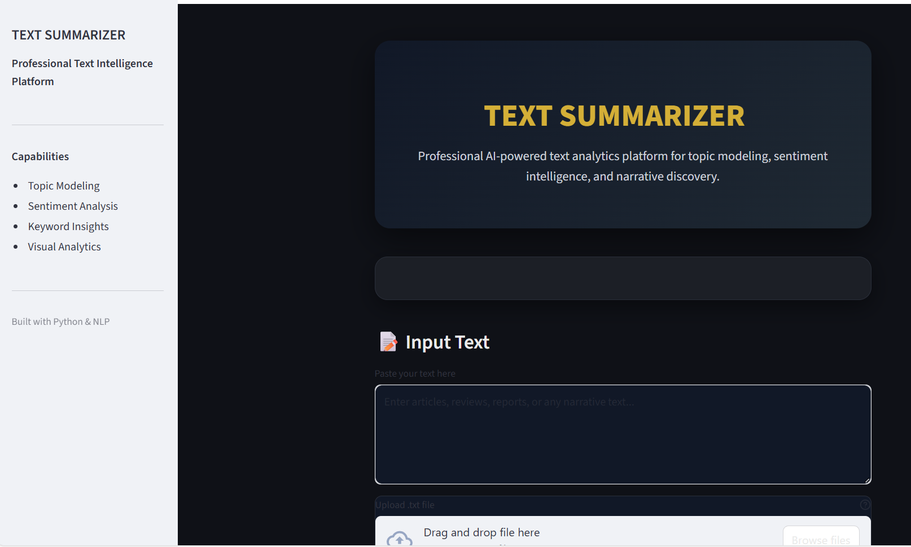
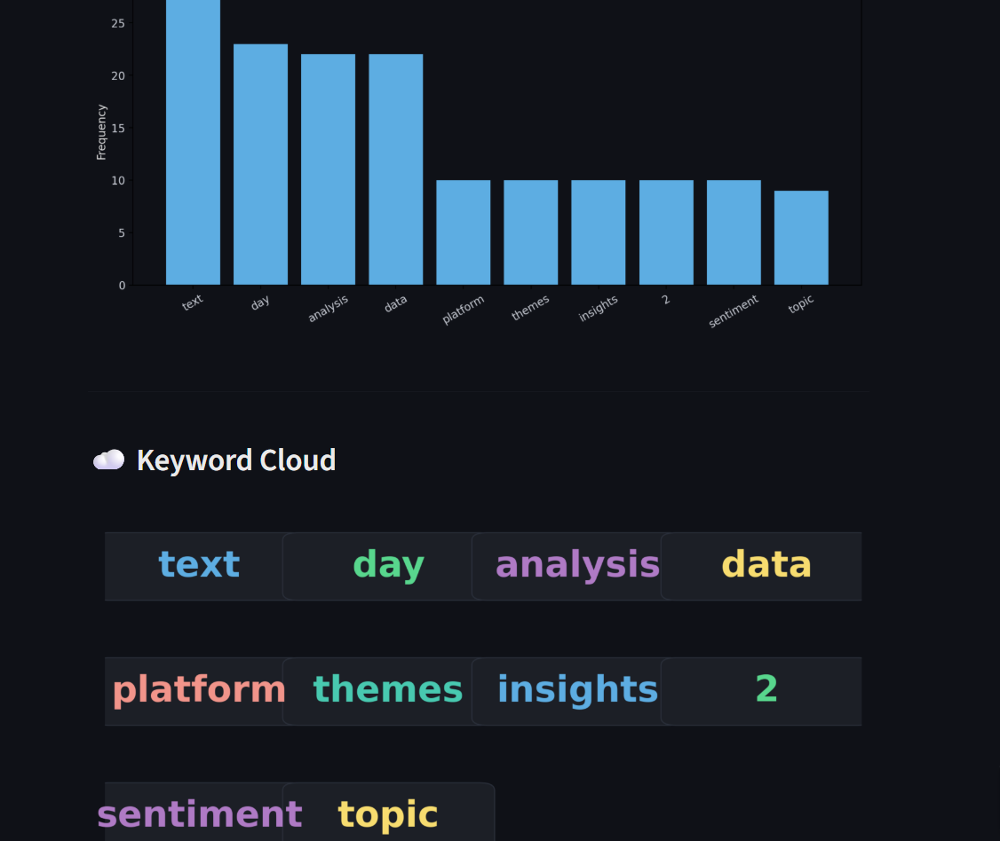

# 🧠 AI Narrative Nexus

AI Narrative Nexus is a Python-based text analysis application with a
user-friendly interface built using Streamlit.  
It performs sentiment analysis, topic extraction, and visualizations
to help users understand textual data easily.

---

## 📌 Project Overview
This project allows users to:
- Upload or enter text
- Analyze sentiment (Positive / Negative / Neutral)
- Extract important topics and keywords
- View results through graphs, word clouds, and UI visuals

The application is designed for academic and learning purposes.

---

## 📸 User Interface Screenshots

### Home Page


### Analysis Page


### Visualization Page



## 🛠️ Technologies Used
- Python
- Streamlit
- Natural Language Processing (NLP)
- Matplotlib
- NLTK
- Git & GitHub

## 📂 Project Structure

    INFOSYS_PROJ/
    │
    ├── text_analysis_platform/
    │   ├── app.py                   
    │   ├── preprocessing.py         
    │   ├── basic_analysis.py        
    │   ├── advanced_analysis.py     
    │   │
    │   └── images/                  
    │       ├── interface.png
    │       ├── sentiment_analy.png
    │       └── wordcloud.png
    │
    ├── README.md                   
    ├── LICENSE                     
    ├── .gitignore                  
    └── venv/                       


## 🚀 How to Run the Project

Follow the steps below to run the AI Narrative Nexus application locally on your system.

### 1️⃣ Clone the repository
```bash
git clone https://github.com/Vaishnavi-Mugal/VaishnaviG.git
cd infosys_proj

2️⃣ Create and activate a virtual environment (recommended)

For Windows
python -m venv venv
venv\Scripts\activate

3️⃣ Install required dependencies
pip install -r requirements.txt

4️⃣ Run the Streamlit application
streamlit run text_analysis_platform/app.py

5️⃣ View the application

Once the command runs successfully, open your browser and go to:
http://localhost:8501